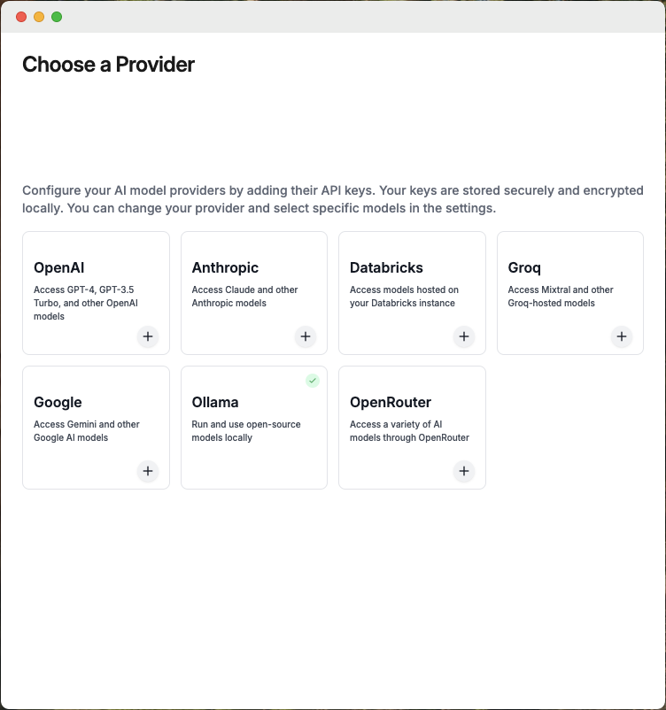

import Tabs from '@theme/Tabs';
import TabItem from '@theme/TabItem';
import Link from "@docusaurus/Link";
import { IconDownload } from "@site/src/components/icons/download";
import SupportedEnvironments from '@site/src/components/SupportedEnvironments';
import RateLimits from '@site/src/components/RateLimits';


# Install Goose

<SupportedEnvironments />

<Tabs>
  <TabItem value="mac" label="macOS" default>
    Choose to install Goose on CLI and/or Desktop:

    <Tabs groupId="interface">
      <TabItem value="cli" label="Goose CLI" default>
        Run the following command to install the latest version of Goose on macOS:

        ```sh
        curl -fsSL https://github.com/block/goose/releases/download/stable/download_cli.sh | bash
        ```
        This script will fetch the latest version of Goose and set it up on your system.

        If you'd like to install without interactive configuration, disable `CONFIGURE`:

        ```sh
        curl -fsSL https://github.com/block/goose/releases/download/stable/download_cli.sh | CONFIGURE=false bash
        ```

        :::tip Updating Goose
        It's best to keep Goose updated. To update Goose, run:
        ```sh
        goose update
        ```
        :::
      </TabItem>
      <TabItem value="ui" label="Goose Desktop">
        To install Goose, click the **button** below:
        <div className="pill-button">
          <Link
            className="button button--primary button--lg"
            to="https://github.com/block/goose/releases/download/stable/Goose.zip"
          >
            <IconDownload />
            download goose desktop for macOS
          </Link>
        </div>
        <div style={{ marginTop: '1rem' }}>
          1. Unzip the downloaded `Goose.zip` file.
          2. Run the executable file to launch the Goose desktop application.

          :::tip Updating Goose
          It's best to keep Goose updated. To update, reperform installation steps.
          :::

          :::note Permissions
            If you’re on an Apple Mac M3 and the Goose desktop app shows no window on launch, check and update the following:

            Ensure the `~/.config` directory has read and write access.

            Goose needs this access to create the log directory and file. Once permissions are granted, the app should load correctly. For steps on how to do this, refer to the  [Troubleshooting Guide](/docs/troubleshooting.md#macos-permission-issues-m3-macs)
          :::
        </div>
      </TabItem>
    </Tabs>
  </TabItem>

  <TabItem value="linux" label="Linux" default>
    Run the following command to install the Goose CLI on Linux:

    ```sh
    curl -fsSL https://github.com/block/goose/releases/download/stable/download_cli.sh | bash
    ```
    This script will fetch the latest version of Goose and set it up on your system.

    If you'd like to install without interactive configuration, disable `CONFIGURE`:

    ```sh
    curl -fsSL https://github.com/block/goose/releases/download/stable/download_cli.sh | CONFIGURE=false bash
    ```   
  </TabItem>

  <TabItem value="windows" label="Windows">
    There isn't native installation support for Windows, however you can run Goose using WSL (Windows Subsystem for Linux).

    1. Open [PowerShell](https://learn.microsoft.com/en-us/powershell/scripting/install/installing-powershell-on-windows) as Administrator and install WSL and the default Ubuntu distribution:

    ```bash
    wsl --install
    ```

    2. Restart your computer if prompted.

    3. Run the Goose installation script:
    ```bash
    curl -fsSL https://github.com/block/goose/releases/download/stable/download_cli.sh | bash
    ```
    :::tip
      If you encounter any issues on download, you might need to install `bzip2` to extract the downloaded file:

      ```bash
      sudo apt update && sudo apt install bzip2 -y
      ```
    :::

    If you'd like to install without interactive configuration, disable `CONFIGURE`:

    ```sh
    curl -fsSL https://github.com/block/goose/releases/download/stable/download_cli.sh | CONFIGURE=false bash
    ```  
  </TabItem>
</Tabs>

## Set LLM Provider
Goose works with a set of [supported LLM providers][providers], and you’ll need an API key to get started. When you use Goose for the first time, you’ll be prompted to select a provider and enter your API key.

<Tabs groupId="interface">
  <TabItem value="cli" label="Goose CLI" default>
    Upon installing, Goose will automatically enter its configuration screen. Here is where you can set up your LLM provider.

    :::tip Windows Users
    Choose to not store to keyring when prompted.
    :::

    Example:

    ```
    ┌   goose-configure
    │
    ◇ What would you like to configure?
    │ Configure Providers
    │
    ◇ Which model provider should we use?
    │ OpenAI
    │
    ◇ Provider openai requires OPENAI_API_KEY, please enter a value
    │▪▪▪▪▪▪▪▪▪▪▪▪▪▪▪▪▪▪▪▪▪▪▪▪▪▪▪▪▪▪▪▪▪▪▪▪▪▪▪▪▪▪▪▪▪▪▪▪▪▪▪▪▪▪▪▪▪▪▪▪▪▪▪▪▪▪▪▪▪▪▪▪▪▪▪▪▪
    │
    ◇ Enter a model from that provider:
    │ gpt-4o
    │
    ◇  Welcome aboard! You're all set to start using this agent—let's achieve great things together!
    │
    └  Configuration saved successfully
  ```

  :::info Windows Users
  On initial run, you may encounter errors about keyrings when setting your API Keys. Set the needed environment variables manually, e.g.:

  ```bash
  export OPENAI_API_KEY={your_api_key}
  ```

  To make the changes persist in WSL across sessions, add the goose path and export commands to your `.bashrc` or `.bash_profile` file so you can load it later.

  ```bash
  echo 'export PATH="$HOME/.local/bin:$PATH"' >> ~/.bashrc
  echo 'export OPENAI_API_KEY=your_api_key' >> ~/.bashrc
  source ~/.bashrc
  ```
  :::
  </TabItem>
  <TabItem value="ui" label="Goose Desktop">
    Upon installing, the Provider screen will appear. Here is where you can choose your LLM Provider.

    

    Once selecting your provider, you'll be prompted to enter an API key if applicable. Do so, and click `Submit`.
  </TabItem>
</Tabs>

## Update Provider
<Tabs groupId="interface">
  <TabItem value="cli" label="Goose CLI" default>
    **To update your LLM provider and API key:**
    1. Run the following command:
    ```sh
    goose configure
    ```
    2. Select `Configure Providers` from the menu.
    3. Follow the prompts to choose your LLM provider and enter or update your API key.

    **Example:**

    To select an option during configuration, use the up and down arrows to highlight your choice then press Enter.

    ```
    ┌   goose-configure
    │
    ◇ What would you like to configure?
    │ Configure Providers
    │
    ◇ Which model provider should we use?
    │ Google Gemini
    │
    ◇ Provider Google Gemini requires GOOGLE_API_KEY, please enter a value
    │▪▪▪▪▪▪▪▪▪▪▪▪▪▪▪▪▪▪▪▪▪▪▪▪▪▪▪▪▪▪▪▪▪▪▪▪▪▪▪▪▪▪▪▪▪▪▪▪▪▪▪▪▪▪▪▪▪▪▪▪▪▪▪▪▪▪▪▪▪▪▪▪▪▪▪▪▪
    │
    ◇ Enter a model from that provider:
    │ gemini-2.0-flash-exp
    │
    ◇  Hello there! You're all set to use me, so please ask away!
    │
    └  Configuration saved successfully
    ```
  </TabItem>
  <TabItem value="ui" label="Goose Desktop">
  **To update your LLM provider and API key:**

    1. Click on the three dots in the top-right corner.
    2. Select `Provider Settings` from the menu.
    2. Choose a provider from the list.
    3. Click Edit, enter your API key, and click `Set as Active`.

  </TabItem>
</Tabs>

<RateLimits />

## Running Goose

<Tabs groupId="interface">
    <TabItem value="cli" label="Goose CLI" default>
        From your terminal, navigate to the directory you'd like to start from and run:
        ```sh
        goose session
        ```
    </TabItem>
    <TabItem value="ui" label="Goose Desktop">
        Starting a session in the Goose Desktop is straightforward. After choosing your provider, you’ll see the session interface ready for use.

        Type your questions, tasks, or instructions directly into the input field, and Goose will get to work immediately.
    </TabItem>
</Tabs>

## Additional Resources

You can also configure Extensions to extend Goose's functionality, including adding new ones or toggling them on and off. For detailed instructions, visit the [Using Extensions Guide][using-extensions].

[using-extensions]: /docs/getting-started/using-extensions
[providers]: /docs/getting-started/providers
[handling-rate-limits]: /docs/guides/handling-llm-rate-limits-with-goose
[mcp]: https://www.anthropic.com/news/model-context-protocol
