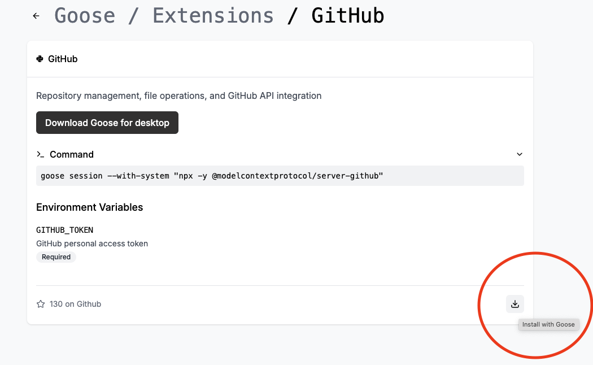
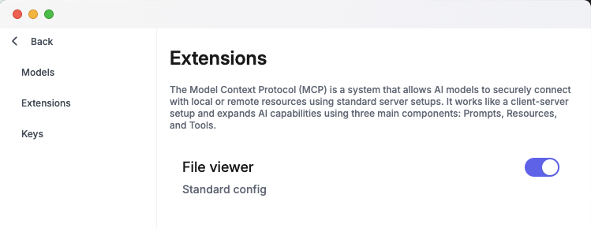

import Tabs from '@theme/Tabs';
import TabItem from '@theme/TabItem';

Extensions are add-ons that provide a way to extend the functionality of Goose by connecting with applications and tools you already use in your workflow. These extensions can be used to add new features, access data and resources, or integrate with other systems.

Extensions are based on the [Model Context Protocol (MCP)](https://github.com/modelcontextprotocol), so you can connect
Goose to a wide ecosystem of capabilities.

## Built-in Extensions
Out of the box, Goose is installed with a few extensions but with only the `Developer` extension enabled by default.

Here are the built-in extensions:

1. **Developer**: provides a set of general development tools that are useful for software development.
2. **Computer Controller**: provides general computer control tools for webscraping, file caching, and automations.
3. **Memory**: teaches goose to remember your preferences as you use it
4. **JetBrains**: provides an integration for working with JetBrains IDEs.
5. **Google Drive**: provides an integration for working with Google Drive for file management and access.


#### Toggling Built-in Extensions

<Tabs groupId="interface">

  <TabItem value="cli" label="Goose CLI" default>
    
    If you know the exact name of the extension you'd like to add, run:

    ```sh
    goose mcp {name}
    ```

    To navigate through available extensions:

    1. Run the following command:
    ```sh
    goose configure
    ```
    2. Select `Add Extension` from the menu.
    3. Choose the type of extension you’d like to add:
        - `Built-In Extension`: Use an extension that comes pre-installed with Goose.
        - `Command-Line Extension`: Add a local command or script to run as an extension.
        - `Remote Extension`: Connect to a remote system via SSE (Server-Sent Events).
    4. Follow the prompts based on the type of extension you selected.

    **Example: Adding Built-in Extension**

    To select an option during configuration, hover over it and press Enter.

    ```
    ┌   goose-configure 
    │
    ◇  What would you like to configure?
    │  Add Extension 
    │
    ◇  What type of extension would you like to add?
    │  Built-in Extension 
    │
    ◆  Which built-in extension would you like to enable?
    │  ○ Developer Tools 
    │  ○ Computer Controller (controls for webscraping, file caching, and automations)
    │  ○ Google Drive 
    │  ○ Memory 
    │  ● JetBrains 
    └  
    ```
  </TabItem>
  <TabItem value="ui" label="Goose Desktop">
  1. Click `...` in the top right corner of the Goose Desktop.
  2. Select `Settings` from the menu.
  3. Under `Extensions`, you can toggle the built-in extensions on or off.
  </TabItem>
</Tabs>


:::tip
All of Goose's built-in extensions are MCP servers in their own right. If you'd like
to use the MCP servers included with Goose with any other agent, you are free to do so.
:::


## Discovering Extensions

Goose provides a [central directory][extensions-directory] of extensions that you can install and use. The page will give you a test command to try out extensions before installing them. 

## Adding Extensions

Extensions can be installed directly via the [extensions directory][extensions-directory], CLI, or UI.

:::tip
For advanced users, you can also edit the `~/.config/goose/config.yaml` file directly to add an extension. 
:::

<Tabs groupId="interface">
  <TabItem value="cli" label="Goose CLI" default>
  
  1. Run the following command: 

    ```
    goose configure
    ```
  2. Select `Add Extension` from the menu.
  3. Choose the type of extension you’d like to add:
      - `Built-In Extension`: Use an extension that comes pre-installed with Goose.
      - `Command-Line Extension`: Add a local command or script to run as an extension.
      - `Remote Extension`: Connect to a remote system via SSE (Server-Sent Events).
  4. Follow the prompts based on the type of extension you selected.

  Example of adding Command-Line Extension:

  ```
  ┌   goose-configure 
  │
  ◇  What would you like to configure?
  │  Add Extension 
  │
  ◇  What type of extension would you like to add?
  │  Command-line Extension 
  │
  ◇  What would you like to call this extension?
  │  fetch
  │
  ◇  What command should be run?
  │  uvx mcp-server-fetch
  │
  ◇  Would you like to add environment variables?
  │  No 
  │
  └  Added fetch extension
  ```

  </TabItem>
  <TabItem value="ui" label="Goose Desktop">
 
  1. Click `...` in the top right corner of the Goose Desktop.
  2. Select `Settings` from the menu.
  3. Under `Extensions`, you can toggle the built-in extensions on or off.

  
  </TabItem>
</Tabs>

### MCP Servers

You can install [any MCP server](https://github.com/modelcontextprotocol/servers?tab=readme-ov-file#model-context-protocol-servers) as a Goose extension. 

<Tabs groupId="interface">
  <TabItem value="cli" label="Goose CLI" default>

    1. Run 
    ```sh
    goose configure
    ```
    2. Choose `Add Extension`
    3. Choose `Command-line Extension`

    You'll then be prompted to enter a command and any environment variables needed. 

  </TabItem>
  <TabItem value="ui" label="Goose Desktop">

  1. Click `...` in the top right corner of the Goose Desktop.
  2. Select `Settings` from the menu.
  3. Under `Extensions`, you can add a MCP server as an extension manually by clicking on the (+) button to the right.
  4. In the dialog that appears, enter the details of the MCP server including any environment variables needed.
  </TabItem>
</Tabs>

For example, to connect to the [Fetch Server](https://github.com/modelcontextprotocol/servers/tree/main/src/fetch), enter `uvx mcp-server-fetch` as the command.

    :::tip
    You can also directly edit the resulting config entry (`~/.config/goose/config.yaml`), which would look like this:

    ```yaml
    extensions:
      fetch:
        name: fetch
        cmd: uvx
        args: [mcp-server-fetch]
        enabled: true
        envs: {}
        type: stdio
    ```
    :::


## Enabling/Disabling Extensions

You can enable or disable installed extensions based on your workflow needs.

<Tabs groupId="interface">
  <TabItem value="cli" label="Goose CLI" default>
    1. Run the following command to open up Goose's configurations:
    ```sh
    goose configure
    ```
    2. Select `Toggle Extensions` from the menu.
    3. A list of already installed extensions will populate.
    4. Press the `space bar` to toggle the extension. Solid means enabled. 

    **Example:**

    ```
    ┌   goose-configure 
    │
    ◇  What would you like to configure?
    │  Toggle Extensions 
    │
    ◆  enable extensions: (use "space" to toggle and "enter" to submit)
    │  ◼ developer 
    │  ◻ fetch 
    └   
    ```
  </TabItem>
  <TabItem value="ui" label="Goose Desktop">
  1. Click the three dots in the top-right corner of the application.
  2. Select `Settings` from the menu, then click on the `Extensions` section.
  2. Use the toggle switch next to each extension to enable or disable it.

  

  </TabItem>
</Tabs>


## Removing Extensions

You can remove installed extensions. 

<Tabs groupId="interface">
<TabItem value="cli" label="Config file" default>
    To remove extensions, open `~/.config/goose/config.yaml` and delete the extensions.
  </TabItem>
  <TabItem value="ui" label="Goose Desktop">

  1. Click `...` in the top right corner of the Goose Desktop.
  2. Select `Settings` from the menu.
  3. Under `Extensions`, find the extension you'd like to remove and click on the settings icon beside it.
  4. In the dialog that appears, click `Remove Extension`.

  </TabItem>
</Tabs>


## Starting a Session with Extensions

You can start a tailored goose session with specific extensions directly from the CLI. To do this, run the following command:

```bash
goose session --with-extension "{extension command}"
```

:::note
You may need to set necessary environment variables for the extension to work correctly.
```bash
goose session --with-extension "VAR=value command arg1 arg2"
```
:::

## Developing Extensions
Goose extensions are implemented with MCP, a standard protocol that allows AI models and agents to securely connect with local or remote resources. Learn how to build your own [extension as an MCP server](https://modelcontextprotocol.io/quickstart/server).


[extensions-directory]: https://block.github.io/goose/v1/extensions
