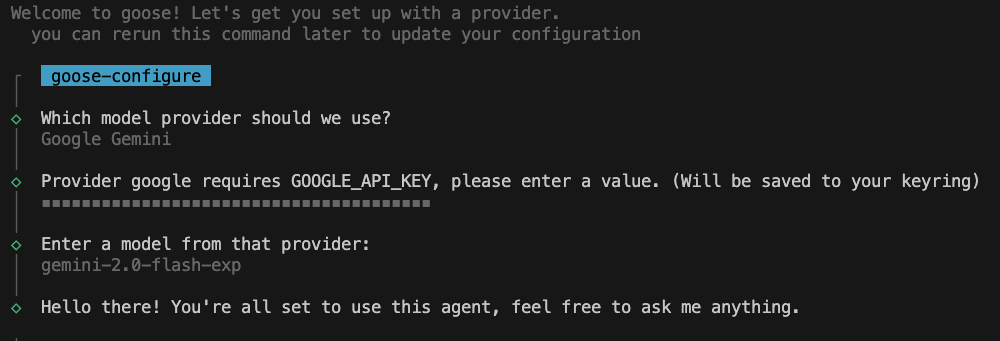

import Tabs from '@theme/Tabs';
import TabItem from '@theme/TabItem';

# Using Goose for Free

:::info Supported Environments
Goose currently works only on **OSX** and **Linux** systems, and supports both **ARM** and **x86** architectures. If you'd like to request support for additional operating systems, please [open an issue on GitHub](https://github.com/block/goose/issues/new?template=Blank+issue) to let us know.
:::

Goose is a free and open source developer AI agent that you can start using right away, but not all supported [LLM Providers][providers] provide a free tier. 

Below, we outline a couple of free options and how to get started with them.


## Google Gemini
Google Gemini provides free access to its AI capabilities with some limitations. To start using the Gemini API with Goose, you need an API Key from [Google AI studio](https://aistudio.google.com/app/apikey).

To set up Google Gemini with Goose, follow these steps:

<Tabs groupId="interface">
  <TabItem value="cli" label="Goose CLI" default>
    1. Run: 
    ```sh
    goose configure
    ```
    2. Select `Configure Providers` from the menu.
    3. Follow the prompts to choose `Google Gemini` as the provider and enter your API key. 

    
    
  </TabItem>
  <TabItem value="ui" label="Goose UI">
  **To update your LLM provider and API key:** 

    1. Click on the three dots in the top-right corner.
    2. Select `Provider Settings` from the menu.
    2. Choose `Google Gemini` as provider from the list.
    3. Click Edit, enter your API key, and click `Set as Active`.

  </TabItem>
</Tabs>

## Limitations

These free options are a great way to get started with Goose and explore its capabilities. However, if you need more advanced features or higher usage limits, you can upgrade to a paid plan with your LLM provider.

---

If you have any questions or need help with a specific provider, feel free to reach out to us on [Discord](https://discord.gg/block-opensource) or on the [Goose repo](https://github.com/block/goose).


[providers]: /docs/configuration/providers