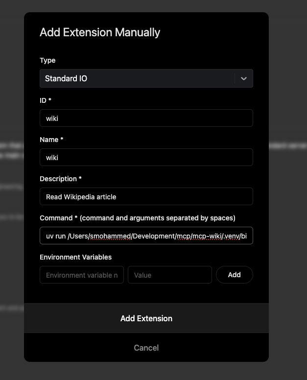

# Building Custom Extensions with Goose


Goose allows you to extend its functionality by creating your own custom extensions, which are built as MCP servers. These extensions are compatible with Goose because it adheres to the [Model Context Protocol (MCP)][mcp-docs]. MCP is an open protocol that standardizes how applications provide context to LLMs. It enables a consistent way to connect LLMs to various data sources and tools, making it ideal for extending functionality in a structured and interoperable way. 

In this guide, we build an MCP server using the [Python SDK for MCP][mcp-python]. We’ll demonstrate how to create an MCP server that reads Wikipedia articles and converts them to Markdown, integrate it as an extension in Goose. You can follow a similar process to develop your own custom extensions for Goose.

You can checkout other examples in this [MCP servers repository][mcp-servers]. MCP SDKs are also available in [Typescript][mcp-typescript] and [Kotlin][mcp-kotlin].

:::info

Goose currently supports Tools and Resources for [MCP Server features](https://spec.modelcontextprotocol.io/specification/2024-11-05/server/). 
We will be adding support for MCP Prompts soon.

:::

---

## Step 1: Initialize Your Project

The first step is to create a new project using [uv][uv-docs]. We will name our project `mcp-wiki`.

Run the following commands in your terminal to set up a basic structure for your MCP server:

```bash
uv init mcp-wiki

cd mcp-wiki
rm hello.py

mkdir -p src/mcp_wiki
touch src/mcp_wiki/server.py  # Your MCP server code (tool, resources, prompts)
touch src/mcp_wiki/__init__.py  # Primary CLI entry point
touch src/mcp_wiki/__main__.py # To enable running as a Python module
```

Your project directory structure should look like this:

```plaintext
.
├── README.md
├── pyproject.toml
├── src
│   └── mcp_wiki
│       ├── __init__.py
│       ├── __main__.py
│       └── server.py
└── uv.lock
```

---

## Step 2: Write Your MCP Server Code

In this step, we’ll implement the core functionality of the MCP server. Here is a breakdown of the key components:

1. **`server.py`**: This file holds the main MCP server code. In this example, we define a single tool to read Wikipedia articles. You can add your own custom tools, resources, and prompts here.
2. **`__init__.py`**: This is the primary CLI entry point for your MCP server.
3. **`__main__.py`**: This file allows your MCP server to be executed as a Python module.

Below is the example implementation for the Wikipedia MCP server:

### `server.py`

```python
import requests
from requests.exceptions import RequestException
from bs4 import BeautifulSoup
from html2text import html2text

from mcp.server.fastmcp import FastMCP
from mcp.shared.exceptions import McpError
from mcp.types import ErrorData, INTERNAL_ERROR, INVALID_PARAMS

mcp = FastMCP("wiki")

@mcp.tool()
def read_wikipedia_article(url: str) -> str:
    """
    Fetch a Wikipedia article at the provided URL, parse its main content,
    convert it to Markdown, and return the resulting text.

    Usage:
        read_wikipedia_article("https://en.wikipedia.org/wiki/Python_(programming_language)")
    """
    try:
        # Validate input
        if not url.startswith("http"):
            raise ValueError("URL must start with http or https.")

        response = requests.get(url, timeout=10)
        if response.status_code != 200:
            raise McpError(
                ErrorData(
                    INTERNAL_ERROR,
                    f"Failed to retrieve the article. HTTP status code: {response.status_code}"
                )
            )

        soup = BeautifulSoup(response.text, "html.parser")
        content_div = soup.find("div", {"id": "mw-content-text"})
        if not content_div:
            raise McpError(
                ErrorData(
                    INVALID_PARAMS,
                    "Could not find the main content on the provided Wikipedia URL."
                )
            )

        # Convert to Markdown
        markdown_text = html2text(str(content_div))
        return markdown_text

    except ValueError as e:
        raise McpError(ErrorData(INVALID_PARAMS, str(e))) from e
    except RequestException as e:
        raise McpError(ErrorData(INTERNAL_ERROR, f"Request error: {str(e)}")) from e
    except Exception as e:
        raise McpError(ErrorData(INTERNAL_ERROR, f"Unexpected error: {str(e)}")) from e
```

### `__init__.py`

```python
import argparse
from .server import mcp

def main():
    """MCP Wiki: Read Wikipedia articles and convert them to Markdown."""
    parser = argparse.ArgumentParser(
        description="Gives you the ability to read Wikipedia articles and convert them to Markdown."
    )
    parser.parse_args()
    mcp.run()

if __name__ == "__main__":
    main()
```

### `__main__.py`

```python
from mcp_wiki import main

main()
```

---

## Step 3: Define Project Configuration

Configure your project using `pyproject.toml`. This configuration defines the CLI script so that the mcp-wiki command is available as a binary. Below is an example configuration:

```toml
[project]
name = "mcp-wiki"
version = "0.1.0"
description = "MCP Server for Wikipedia"
readme = "README.md"
requires-python = ">=3.13"
dependencies = [
    "beautifulsoup4>=4.12.3",
    "html2text>=2024.2.26",
    "mcp[cli]>=1.2.0",
    "requests>=2.32.3",
]

[project.scripts]
mcp-wiki = "mcp_wiki:main"

[build-system]
requires = ["hatchling"]
build-backend = "hatchling.build"
```

---

## Step 4: Test Your MCP Server

### Using MCP Inspector

1. Setup the project environment:

   ```bash
   uv sync
   ```

2. Activate your virtual environment:

   ```bash
   source .venv/bin/activate
   ```

3. Run your server in development mode:

   ```bash
   mcp dev src/mcp_wiki/server.py
   ```

4. Go to `http://localhost:5173` in your browser to open the MCP Inspector UI.

5. In the UI, you can click "Connect" to initialize your MCP server. Then click on "Tools" tab > "List Tools" and you should see the `read_wikipedia_article` tool. 
   Then you can try to call the `read_wikipedia_article` tool with URL set to "https://en.wikipedia.org/wiki/Bangladesh" and click "Run Tool". 


### Testing the CLI

1. Install your project locally:

   ```bash
   uv pip install .
   ```

2. Check the executable in your virtual environment:

   ```bash
   ls .venv/bin/  # Verify your CLI is available
   ```

3. Test the CLI:

   ```bash
   mcp-wiki --help
   ```

   You should see output similar to:

   ```plaintext
   ❯ mcp-wiki --help
   usage: mcp-wiki [-h]

   Gives you the ability to read Wikipedia articles and convert them to Markdown.

   options:
     -h, --help  show this help message and exit
   ```

---

## Step 5: Integrate with Goose

To add your MCP server as an extension in Goose:

1. Go to `Settings > Extensions > Add`.
2. Set the `Type` to `StandardIO`.
3. Provide the ID, name, and description for your extension.
4. In the `Command` field, provide the absolute path to your executable. For example:
   ```plaintext
   uv run /full/path/to/mcp-wiki/.venv/bin/mcp-wiki
   ```

Alternatively in Step 3, you can also publish your package to pypi. Once published, the server can be run directly using uvx. For example:

```
uvx mcp-wiki
```

For the purposes on this guide, we will show you how to run the local version. 



---

## Step 6: Use Your Extension in Goose

Once integrated, you can start using your extension in Goose. Open the Goose chat interface and call your tool as needed.

You can verify that Goose has picked up the tools from your custom extension by asking it "what tools do you have?"


Then, you can try asking questions that require using the extension you added.


🎉 **Congratulations!** You’ve successfully built and integrated a custom MCP server with Goose.


[mcp-docs]: https://modelcontextprotocol.io/
[mcp-python]: https://github.com/modelcontextprotocol/python-sdk
[mcp-typescript]: https://github.com/modelcontextprotocol/typescript-sdk
[mcp-kotlin]: https://github.com/modelcontextprotocol/kotlin-sdk
[mcp-servers]: https://github.com/modelcontextprotocol/servers
[uv-docs]: https://docs.astral.sh/uv/getting-started/
