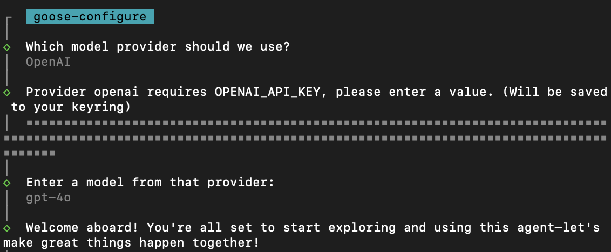

import Tabs from '@theme/Tabs';
import TabItem from '@theme/TabItem';

# Installation

:::info Supported Environments
Goose currently works only on **OSX** and **Linux** systems, and supports both **ARM** and **x86** architectures. If you'd like to request support for additional operating systems, please [open an issue on GitHub](https://github.com/block/goose/issues/new?template=Blank+issue) to let us know.
:::


<Tabs groupId="interface">
  <TabItem value="cli" label="Goose CLI" default>
    #### Installing the Goose CLI
    To install Goose, run the following script on macOS or Linux. 

    ```sh
    curl -fsSL https://github.com/block/goose/releases/download/stable/download_cli.sh | sh
    ```
    This script will fetch the latest version of Goose and set it up on your system.
    
    :::tip Best Practice
    It’s best to keep Goose updated. You can update it by re-running the installation script.
    :::
  </TabItem>
  <TabItem value="ui" label="Goose UI">
    #### Installing the Goose Desktop Application
    To install Goose, click the **button** below:
      <Button 
        label=":arrow_down: Download Goose Desktop" 
        link="https://github.com/block/goose/releases/download/stable/Goose.zip" 
        variant="secondary" 
        size="lg" 
        outline 
      />
    <div style={{ marginTop: '1rem' }}>  
      1. Unzip the downloaded `Goose.zip` file.
      2. Run the executable file to launch the Goose desktop application.
      :::tip Best Practice
      It’s best to keep Goose updated. You can do this by checking the [Goose GitHub Release page](https://github.com/block/goose/releases/stable) and downloading updates when available.
      :::
    </div>  
  </TabItem>
</Tabs>

### Set Up a Provider
Goose works with a set of [supported LLM providers][providers], and you’ll need an API key to get started. When you use Goose for the first time, you’ll be prompted to select a provider and enter your API key.

The process will look similar to the example below:

<Tabs groupId="interface">
  <TabItem value="cli" label="Goose CLI" default>
    
  </TabItem>
  <TabItem value="ui" label="Goose UI">
    
  </TabItem>
</Tabs>

### Update a Provider
<Tabs groupId="interface">
  <TabItem value="cli" label="Goose CLI" default>
    **To update your LLM provider and API key:** 
    1. Run the following command: 
    ```sh
    goose configure
    ```
    2. Select `Configure Providers` from the menu.
    3. Follow the prompts to choose your LLM provider and enter or update your API key. 

    **Example:**

    To select an option during configuration, hover over it and press Enter.

    ```sh
    What would you like to configure?
    > Configure Providers
      Toggle Extensions
      Add Extension

    Which Model provider should we use?
    > OpenAI
      Databricks
      Ollama
    .....

    Enter Api Key:
    >  sk-1234abcd5678efgh
    ```
  </TabItem>
  <TabItem value="ui" label="Goose UI">
  **To update your LLM provider and API key:** 

    1. Click on the three dots in the top-right corner.
    2. Select `Provider Settings` from the menu.
    2. Choose a provider from the list.
    3. Click Edit, enter your API key, and click `Set as Active`.

  </TabItem>
</Tabs>

:::info Billing
You will need to have credits in your LLM Provider account (when necessary) to be able to successfully make requests. Some providers also have rate limits on API usage, which can affect your experience. Check out the [Handling Rate Limits][handling-rate-limits] guide to learn how to efficiently manage these limits while using Goose.
:::

## Running Goose

<Tabs groupId="interface">
    <TabItem value="cli" label="Goose CLI" default>
        From your terminal, navigate to the directory you'd like to start from and run:
        ```sh
        goose session 
        ```
    </TabItem>
    <TabItem value="ui" label="Goose UI">
        Starting a session in the Goose UI is straightforward. After choosing your provider, you’ll see the session interface ready for use.
        
        Type your questions, tasks, or instructions directly into the input field, and Goose will get to work immediately. 

        
    </TabItem>
</Tabs>

## Additional Resources

You can also configure Extensions to extend Goose's functionality, including adding new ones or toggling them on and off. For detailed instructions, visit the [Using Extensions Guide][using-extensions].

[using-extensions]: /docs/configuration/managing-extensions
[providers]: /docs/configuration/providers
[handling-rate-limits]: /docs/guides/handling-llm-rate-limits-with-goose
[mcp]: https://www.anthropic.com/news/model-context-protocol
