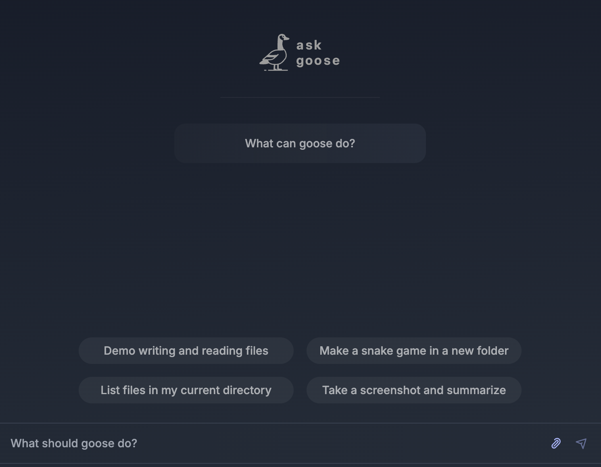

import Tabs from '@theme/Tabs';
import TabItem from '@theme/TabItem';
import Link from "@docusaurus/Link";
import { IconDownload } from "@site/src/components/icons/download";
import SupportedEnvironments from '@site/src/components/SupportedEnvironments';
import RateLimits from '@site/src/components/RateLimits';

# Goose in 5 minutes

<SupportedEnvironments />


Goose is an open source AI agent that supercharges your software development by automating coding tasks. This quick tutorial will guide you through getting started with Goose!


## Install Goose

You can use Goose via CLI or Desktop application.

<Tabs groupId="interface">
  <TabItem value="cli" label="Goose CLI" default>
    Run the following command to install the latest version of Goose:

    ```sh
    curl -fsSL https://github.com/block/goose/releases/download/stable/download_cli.sh | bash
    ```
  </TabItem>
  <TabItem value="ui" label="Goose Desktop (macOS only)">
    To install the latest version of Goose, click the **button** below:
    <div className="pill-button">
      <Link
        className="button button--primary button--lg"
        to="https://github.com/block/goose/releases/download/stable/Goose.zip"
      >
        <IconDownload />
        download goose desktop for macOS
      </Link>
    </div>
    <div style={{ marginTop: '1rem' }}>
      1. Unzip the downloaded `Goose.zip` file.
      2. Run the executable file to launch the Goose desktop application.
    </div>
  </TabItem>
</Tabs>

## Configure Provider

Goose works with [supported LLM providers][providers]. When you install Goose, you'll be prompted to choose your preferred LLM and supply an API key.

<Tabs groupId="interface">
  <TabItem value="cli" label="Goose CLI" default>
    Use the up and down arrow keys to navigate the CLI menu, and press Enter once you've selected a choice.

    ```
    ┌   goose-configure
    │
    ◇ What would you like to configure?
    │ Configure Providers
    │
    ◇ Which model provider should we use?
    │ Google Gemini
    │
    ◇ Provider Google Gemini requires GOOGLE_API_KEY, please enter a value
    │▪▪▪▪▪▪▪▪▪▪▪▪▪▪▪▪▪▪▪▪▪▪▪▪▪▪▪▪▪▪▪▪▪▪▪▪▪▪▪▪▪▪▪▪▪▪▪▪▪▪▪▪▪▪▪▪▪▪▪▪▪▪▪▪▪▪▪▪▪▪▪▪▪▪▪▪▪
    │
    ◇ Enter a model from that provider:
    │ gemini-2.0-flash-exp
    │
    ◇ Hello! You're all set and ready to go, feel free to ask me anything!
    │
    └ Configuration saved successfully
  ```
  </TabItem>
  <TabItem value="ui" label="Goose Desktop">
    
  </TabItem>
</Tabs>

<RateLimits />

:::tip Model Selection
Goose relies heavily on tool calling capabilities and currently works best with Anthropic's Claude 3.5 Sonnet and OpenAI's GPT-4o (2024-11-20) model.
:::

## Start Session
Sessions are single, continuous conversations between you and Goose. Let's start one.

<Tabs groupId="interface">
    <TabItem value="cli" label="Goose CLI" default>
        1. Make an empty directory (e.g. `goose-demo`) and navigate to that directory from the terminal.
        2. To start a new session, run:
        ```sh
        goose session
        ```
    </TabItem>
    <TabItem value="ui" label="Goose Desktop">
        After choosing an LLM provider, you’ll see the session interface ready for use.

        Type your questions, tasks, or instructions directly into the input field, and Goose will immediately get to work.

        
    </TabItem>
</Tabs>

## Write Prompt

From the prompt, you can interact with Goose by typing your instructions exactly as you would speak to a developer.

Let's ask Goose to make a tic-tac-toe game!

```
create an interactive browser-based tic-tac-toe game in javascript where a player competes against a bot
```

Goose will create a plan and then get right to work on implementing it. Once done, your directory should contain a JavaScript file as well as an HTML page for playing.


## Install an Extension

While you're able to manually navigate to your working directory and open the HTML file in a browser, wouldn't it be better if Goose did that for you? Let's give Goose the ability to open a web browser by enabling the `Computer Controller` extension.

<Tabs groupId="interface">
    <TabItem value="cli" label="Goose CLI" default>
        1. End the current session by entering `Ctrl+C` so that you can return to the terminal's command prompt.
        2. Run the configuration command
        ```sh
        goose configure
        ```
        3. Choose `Add extension` > `Built-in Extension` > `Computer Controller`. This [extension](https://block.github.io/goose/v1/extensions/detail/nondeveloper) enables webscraping, file caching, and automations.
        ```
        ┌   goose-configure
        │
        ◇  What would you like to configure?
        │  Add Extension
        │
        ◇  What type of extension would you like to add?
        │  Built-in Extension
        │
        ◆  Which built-in extension would you like to enable?
        │  ○ Developer Tools
        │  ● Computer Controller (controls for webscraping, file caching, and automations)
        │  ○ Google Drive
        │  ○ Memory
        │  ○ JetBrains
        └
        ```
        4. Now that Goose has browser capabilities, let's resume your last session:
        ```sh
         goose session -r
        ```
        5. Ask Goose to launch your game in a browser:
    </TabItem>
    <TabItem value="ui" label="Goose Desktop">
        1. Locate the menu (`...`) in the top right corner of the Goose Desktop.
        2. Select `Settings` from the menu.
        3. Under the `Extensions` section, toggle the `Computer Controller` extension to enable it. This [extension](https://block.github.io/goose/v1/extensions/detail/nondeveloper) enables webscraping, file caching, and automations.
        4. Click `<- Back` in the upper left corner to return to your session.
        5. Now that Goose has browser capabilities, let's ask it to launch your game in a browser:
    </TabItem>
</Tabs>

```
open index.html in a browser
```

Go ahead and play your game, I know you want to 😂 ... good luck!


## Next Steps
Congrats, you've successfully used Goose to develop a web app! 🎉

Here are some ideas for next steps:
* Continue your session with Goose and it improve your game (styling, functionality, etc).
* Browse other available [extensions][extensions-guide] and install more to enhance Goose's functionality even further.
* Provide Goose with a [set of hints](/docs/guides/using-goosehints) to use within your sessions.


[handling-rate-limits]: /docs/guides/handling-llm-rate-limits-with-goose
[openai-key]: https://platform.openai.com/api-keys
[getting-started]: /docs/category/getting-started
[providers]: /docs/getting-started/providers
[managing-sessions]: /docs/guides/managing-goose-sessions
[contributing]: https://github.com/block/goose/blob/main/CONTRIBUTING.md
[quick-tips]: /docs/guides/tips
[extensions-guide]: /docs/getting-started/using-extensions
[cli]: /docs/guides/goose-cli-commands
[MCP]: https://www.anthropic.com/news/model-context-protocol
