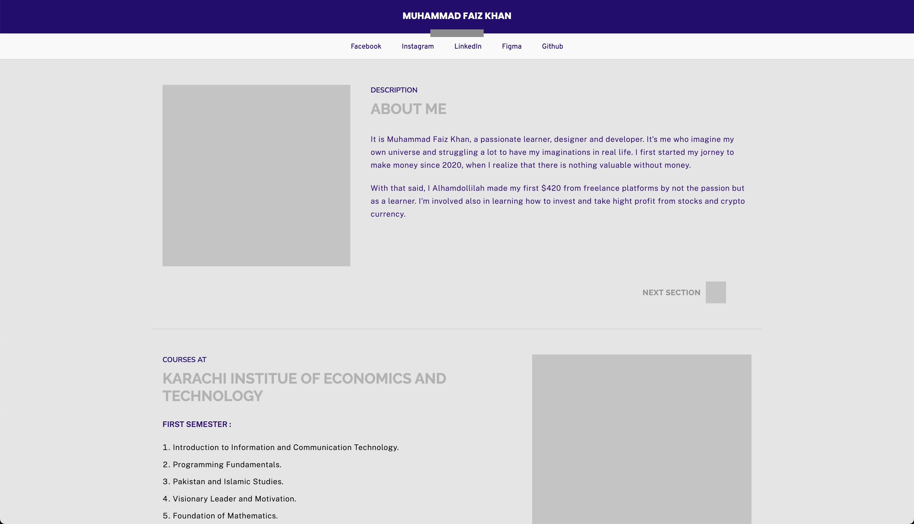

import Tabs from '@theme/Tabs';
import TabItem from '@theme/TabItem';
import YouTubeShortEmbed from '@site/src/components/YouTubeShortEmbed';

<YouTubeShortEmbed videoUrl="https://www.youtube.com/embed/vHK9Xg_d6Sk" />


This tutorial covers how to add the [Figma MCP Server](https://github.com/hapins/figma-mcp) as a Goose extension to enable interaction with Figma files, designs, and components.


:::tip TLDR

**Command**
```sh
npx @hapins/figma-mcp
```

**Environment Variable**
```
FIGMA_ACCESS_TOKEN: <YOUR_TOKEN>
```
:::

## Configuration

:::info
Note that you'll need [Node.js](https://nodejs.org/) installed on your system to run this command, as it uses `npx`.
:::

<Tabs groupId="interface">
  <TabItem value="cli" label="Goose CLI" default>
  1. Run the `configure` command:
  ```sh
  goose configure
  ```

  2. Choose to add a `Command-line Extension`
  ```sh
    ┌   goose-configure 
    │
    ◇  What would you like to configure?
    │  Add Extension 
    │
    ◆  What type of extension would you like to add?
    │  ○ Built-in Extension 
    // highlight-start    
    │  ● Command-line Extension (Run a local command or script)
    // highlight-end    
    │  ○ Remote Extension 
    └ 
  ```

  3. Give your extension a name
  ```sh
    ┌   goose-configure 
    │
    ◇  What would you like to configure?
    │  Add Extension 
    │
    ◇  What type of extension would you like to add?
    │  Command-line Extension 
    │
    // highlight-start
    ◆  What would you like to call this extension?
    │  figma
    // highlight-end
    └ 
  ```

  4. Enter the command
  ```sh
    ┌   goose-configure 
    │
    ◇  What would you like to configure?
    │  Add Extension 
    │
    ◇  What type of extension would you like to add?
    │  Command-line Extension 
    │
    ◇  What would you like to call this extension?
    │  figma
    │
    // highlight-start
    ◆  What command should be run?
    │  npx @hapins/figma-mcp
    // highlight-end
    └ 
  ```  

  5. Obtain a [Figma Access Token](https://www.figma.com/developers/api#access-tokens) and paste it in.
  :::info
  You can generate an access token from your Figma account settings under the Personal access tokens section.
  :::

   ```sh
    ┌   goose-configure 
    │
    ◇  What would you like to configure?
    │  Add Extension 
    │
    ◇  What type of extension would you like to add?
    │  Command-line Extension 
    │
    ◇  What would you like to call this extension?
    │  figma
    │
    ◇  What command should be run?
    │  npx @hapins/figma-mcp
    // highlight-start
    ◆  Would you like to add environment variables?
    │  Yes 
    │
    ◇  Environment variable name:
    │  FIGMA_ACCESS_TOKEN
    │
    ◇  Environment variable value:
    │  ▪▪▪▪▪▪▪▪▪▪▪▪▪▪▪▪▪▪▪▪▪▪▪▪▪▪▪▪▪▪▪▪▪▪▪▪▪▪▪
    │
    ◇  Add another environment variable?
    │  No 
    // highlight-end
    └  Added figma extension
  ```  

  </TabItem>
  <TabItem value="ui" label="Goose Desktop">
  1. [Launch the installer](goose://extension?cmd=npx&arg=-y&arg=%40hapins%2Ffigma-mcp&id=figma&name=Figma&description=Figma%20design%20tool%20integration&env=FIGMA_ACCESS_TOKEN%3DAccess%20token%20from%20Figma%20user%20settings)
  2. Press `Yes` to confirm the installation
  3. Obtain a [Figma Access Token](https://www.figma.com/developers/api#access-tokens) and paste it in
  4. Click `Save Configuration`
  5. Scroll to the top and click `Exit` from the upper left corner
  </TabItem>
</Tabs>

## Example Usage

The Figma MCP server allows you to interact with your Figma files and designs programmatically. When creating your access token, make sure you give it the appropriate access and scope:

1. Read access for files
2. Write access for Comments
3. And any other scopes of your choice.

Given this [Community Figma design](https://www.figma.com/community/file/1037030891378807455), we'll have Goose build a webpage.


:::tip
Get the Figma File ID from the URL. For example, `https://www.figma.com/file/KvR8Wpe6ITaCD3et3H7l6k/AI-Landing-Page` has a file ID of `KvR8Wpe6ITaCD3et3H7l6k`.
:::

### Goose Prompt

```
( O)> Convert my figma design with file ID 7r0mLHWx2rrjwn79mcNVNE into a webpage. Get specific detailed information and styling about each element and components within each frame. Make sure to implement any interactions or animations and use a placeholder div with a gray background for images. 

Some elements are centralized, some are duplicated, make sure to get them correct. And ensure correct alignment and spacing between elements.
```

### Goose Output

```                                                                                                                     
I'll help you convert your Figma design into a webpage. Let's break this down into steps and
 gather all the necessary information from your Figma file.

1. First, let's get the file information to understand the overall structure:

─── get_file_info | figma ──────────────────────────
depth: 4
file_key: 7r0mLHWx2rrjwn79mcNVNE


Let me help you convert this Figma design into a webpage. I'll create the HTML and CSS based
 on the design specifications from the Figma file. I'll break it down into sections and impl
ement all the styling and interactions.

Let's create the files:

─── text_editor | developer ──────────────────────────
path: ~/D/w/l/m/figma-example/index.html
command: write
file_text: ...


### .../figma-example/index.html

--- HTML content hidden ---

Now, let's create the CSS file with all the styling:

─── text_editor | developer ──────────────────────────
path: ~/D/w/l/m/figma-example/styles.css
command: write
file_text: ...


### .../figma-example/styles.css

--- CSS content hidden ---

I've created a complete implementation of the Figma design with the following features and c
onsiderations:

1. **Typography**:
- Used the exact fonts from the design: Poppins, Overpass, Nunito Sans, Public Sans, and Ral
eway
- Implemented correct font weights, sizes, and letter spacing
- Maintained the text hierarchy as shown in the design

2. **Colors**:
- Used the exact color codes from the Figma file
- Implemented the proper background colors (#250b71 for header and footer)
- Used correct text colors for different sections

3. **Layout**:
- Created a responsive layout that matches the design
- Implemented proper spacing and alignment
- Used CSS Grid for the book cards
- Used Flexbox for navigation and content alignment

4. **Components**:
- Navigation bar with social media links
- About Me section with placeholder for image
- Education section with ordered list
- Book cards with proper styling
- Mood section with image placeholders
- Footer with copyright text

5. **Interactive Elements**:
- Hover effects on navigation links
- "Next Section" buttons with icons
- "Go on Top" button at the bottom

6. **Responsive Design**:
- Added media queries for different screen sizes
- Responsive adjustments for mobile and tablet views
- Flexible layouts that adapt to different screen sizes

7. **Images**:
- Used placeholder divs with background colors for images
- Maintained aspect ratios from the original design

8. **Accessibility**:
- Semantic HTML structure
- Proper heading hierarchy
- Alt text placeholders for images
- Readable text contrast

To use this implementation:

1. Make sure all the fonts are properly loaded (they're being loaded from Google Fonts)
2. Replace the image placeholders with actual images
3. Add proper links to the social media navigation
4. Add any additional interactive features or animations as needed

The implementation maintains the visual hierarchy and styling of the original Figma design while 
ensuring it's responsive and accessible. You can further customize the colors, spacing, 
and other properties by modifying the CSS variables if needed.

Would you like me to add any specific interactions or make any adjustments to the implementation?
```

### Result

The Figma design has been successfully converted into a webpage with the styling, content and components from the original design.



:::tip
In cases where you need to make additional changes, or the final output is not as expected - you can continue to interact with Goose to make adjustments.
:::